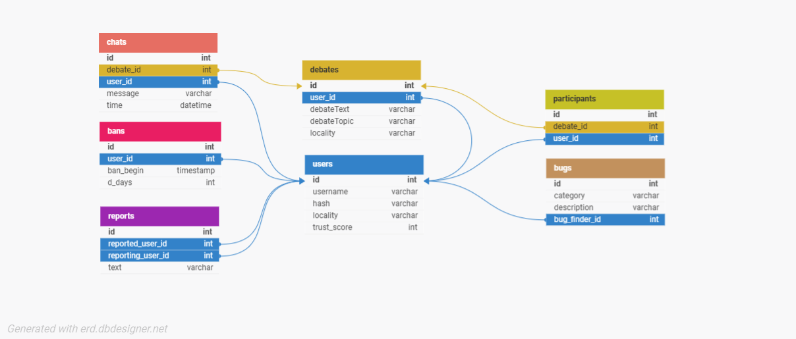

# DEBATE.
### Video Presentation: TO ADD

**Debate.** is a social network that allows you to debate about any subject you want with anybody. You can set your own debate and wait for others to join it.

# Libraries and external tools used

The app is programmed using Python's [Flask](https://flask.palletsprojects.com/en/) library for the server side, and HTML/CSS/Javascript for the client side. It is worth noticing the use of [Bootstrap](https://getbootstrap.com/) in add to the css code.
  
The webapp is hosted on [Pythonanywhere](https://www.pythonanywhere.com/) at the following URL: https://www.julianxbloom.pythonanywhere.com/. It is an online web hosting service, but it also contains a MySQL server on which I was able to host the app's database.
  
Data about the users is stored in this database, as well as data about every specific debate and even more: here is the relational diagram of **Debate.'s** database:

It is worth mentionning passwords are hashed using [Argon2 for Python](https://argon2-cffi.readthedocs.io/en/stable/). 

Lastly, it is important to mention the app is designed for **Android devices** only.

# Features
## Fundamentals
Users have the ability to:
<ul>
  <li><b>create</b> new debates</li>
  <li><b>live-chat</b> with other users about a specific debate (programmed using <a href="https://flask-socketio.readthedocs.io/en/latest/">flask-socketio</a>, and adapted to Pythonanywhere using <a href="https://help.pythonanywhere.com/pages/FlaskSocketIO/">this</a> help page)</li>
  <li><b>join</b> any debate they want (by scrolling in the main menu or searching for a debate)</li>
</ul>

## Moderation
The conversations are ruled around **Trust Score**: a rate out of a hundread that is meant to reflect the user's good or bad behaviour on the app (a low Trust Score will lead to a temporary ban from Debate). This score is accessible throught any user's profile page, as well as details about the sanctions that can be encoutered.
  
The debaters are able to report the others throught their profile page, a report that will be count as valid after having being read by an administrator of the app. Indeed, adminstrators can use the programmed administration console to manage users. It gives them the ability to proceed bugs and reports, to access users' chat history and to ban users. Look at [admin.py](https://github.com/julianxbloom/CS50-FinalProject/blob/main/admin.py) file for more information about the console's features.

# PWA

Moreover, this app is designed as a **Progressive Web Application** (also know as PWA). This means it can be downloaded from your web browser directly to your phone. It will then appear as any other application. For more information about PWA's, look at [this link](https://developer.mozilla.org/en-US/docs/Web/Progressive_web_apps).

# Bug feedback

In the app's settings, users are able to provide a feedback to the developers, a good help to spot unexpected bugs...

